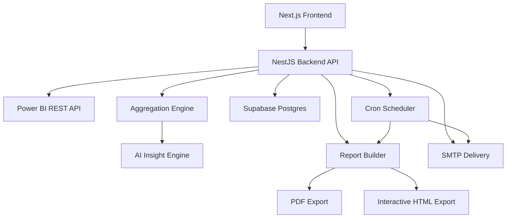

# Power AI BI Platform

End-to-end AI-powered BI reporting platform built as a monorepo with a strict frontend/backend separation:

- `frontend/`: Next.js App Router UI + Supabase client auth + embedded chat UX
- `backend/`: NestJS API + Power BI integration + aggregation + AI + PDF/email/scheduler
- `supabase/migrations/`: schema, policies, and platform persistence layer

---

## Platform Overview

Power AI connects to Power BI (read-only), allows users to select datasets, generates analytical reports (KPIs + charts + AI insights), supports downloadable PDF and interactive HTML outputs, and schedules recurring report emails via SMTP.

### Core capabilities

- Read-only Power BI dataset discovery and query execution
- Excel upload fallback pipeline for test/demo or partial Power BI readiness
- KPI + chart generation from server-side aggregation logic
- AI insights + embedded assistant chat using OpenRouter/OpenAI-compatible API
- Export to professional PDF and interactive HTML
- Scheduled report automation with SMTP delivery
- Supabase-based auth/session + persistence

---

## End-to-End Architecture



---

## Repository Structure

```text
powerni/
  backend/                   # NestJS API and domain modules
  frontend/                  # Next.js App Router UI
  supabase/
    migrations/001_init.sql  # Initial schema + RLS
  README.md
```

---

## Technology Stack

### Frontend

- Next.js 14 (App Router, TypeScript)
- Tailwind CSS
- Supabase JS/Auth (browser + SSR helpers)
- Lucide icons

### Backend

- NestJS 10 (TypeScript)
- Supabase service-role client
- Axios (API integrations)
- OpenAI SDK (pointed to OpenRouter base URL)
- Nodemailer (SMTP)
- Puppeteer (PDF rendering)
- `@nestjs/schedule` (cron processing)

### Data and Infra

- Supabase Postgres + Auth + RLS
- Power BI REST API + Azure AD app credentials
- SMTP provider (Gmail App Password or equivalent)

---

## Prerequisites

1. Node.js 18+ and npm
2. Supabase project
3. Azure AD app registration for Power BI API access
4. Power BI workspace where service principal is added
5. SMTP account/app password

---

## Setup (Start to End)

### 1) Database

Run:

- `supabase/migrations/001_init.sql`

in Supabase SQL Editor.

### 2) Environment files

- Copy `backend/.env.example` -> `backend/.env`
- Copy `frontend/.env.example` -> `frontend/.env.local`

Fill all required values.

### 3) OAuth providers

- In Supabase Auth -> Providers, enable Google
- In Google Cloud OAuth client:
  - Authorized origin: Supabase URL
  - Redirect URI: `https://<project-ref>.supabase.co/auth/v1/callback`
- In Supabase URL configuration:
  - Site URL: frontend URL (for local: `http://localhost:3000`)
  - Additional redirect URL: `http://localhost:3000/auth/callback`

### 4) Run services

Terminal A:

```bash
cd backend
npm install
npm run start:dev
```

Terminal B:

```bash
cd frontend
npm install
npm run dev
```

### 5) Verify local URLs

- App: `http://localhost:3000`
- API base: `http://localhost:3001/api`
- Health: `http://localhost:3001/api/health`

---

## Smoke Testing

From `backend/`:

```bash
npm run ensure-smoke-user   # optional, when SMOKE_EMAIL/SMOKE_PASSWORD are configured
npm run smoke
```

The smoke script validates:

- Health + auth session
- Dataset access (or upload fallback)
- Report generation
- Chat query
- SMTP test
- Schedule create/list/delete
- PDF job completion + download

---

## Operational Notes

- If Power BI dataset fetch fails with authorization errors, verify:
  - tenant service principal settings
  - admin consent for API permissions
  - workspace membership/permissions for the app
- Scheduler runs on backend cron and uses DB-backed job state
- PDF generation depends on Puppeteer runtime availability

---

## Security Notes

- Never commit real secrets to git
- Keep keys only in `.env` files and secret managers in production
- Rotate any key that was exposed in chat, screenshots, or commit history

---

## Deployment Guidance

- Frontend deploy target: Vercel / Node host
- Backend deploy target: VM/container with persistent networking
- Configure environment variables per environment (dev/stage/prod)
- Use managed SMTP + Supabase + secure HTTPS domains

---

## Documentation Index

- Frontend docs: `frontend/README.md`
- Backend docs: `backend/README.md`
