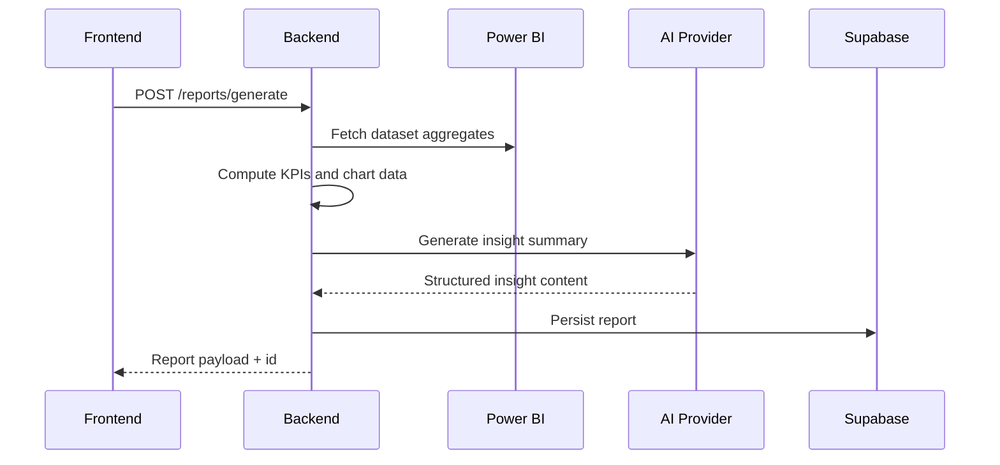

# Backend - Power AI BI Platform

NestJS backend for data ingestion, aggregation, AI analysis, report generation, scheduling, and email delivery.

---

## Responsibilities

- Authenticate/authorize client requests (Supabase JWT validation)
- Connect to Power BI APIs via Azure AD client credentials
- Generate reports from Power BI datasets or uploaded Excel data
- Produce AI insight summaries and answer chat queries
- Generate PDF exports and interactive report artifacts
- Schedule recurring report generation and SMTP email delivery
- Persist operational/report data in Supabase Postgres

---

## Module Overview

- `auth`: session/user validation endpoints
- `datasets`: workspace dataset listing/schema/refresh metadata
- `reports`: report generation, retrieval, export orchestration
- `chat`: AI question-answering over report context
- `powerbi`: Power BI API integration + token handling
- `ai`: OpenAI/OpenRouter integration for insights
- `pdf`: Puppeteer-powered PDF creation
- `email`: SMTP delivery service
- `schedules`: recurring schedule CRUD + processing
- `jobs`: async job state and downloads
- `uploads`: Excel upload fallback path

---

## Tech Stack

- NestJS 10 + TypeScript
- Supabase JS (service-role)
- Axios
- OpenAI SDK
- Nodemailer
- Puppeteer
- `@nestjs/schedule`
- `class-validator` / `class-transformer`

---

## Environment Configuration

Create `backend/.env` from `backend/.env.example`.

### Required groups

- Service URLs and ports
  - `PORT`
  - `FRONTEND_URL`
- Supabase
  - `SUPABASE_URL`
  - `SUPABASE_ANON_KEY`
  - `SUPABASE_SERVICE_ROLE_KEY`
  - `DATABASE_URL`
- Power BI / Azure AD
  - `TENANT_ID`
  - `CLIENT_ID`
  - `CLIENT_SECRET`
  - `POWERBI_GROUP_ID`
- AI
  - `OPENAI_API_KEY`
  - `OPENAI_BASE_URL` (OpenRouter-compatible)
  - `OPENAI_MODEL`
- SMTP
  - `SMTP_HOST`
  - `SMTP_PORT`
  - `SMTP_SECURE`
  - `SMTP_USER`
  - `SMTP_PASS`
  - `SMTP_FROM`
- Smoke test helpers
  - `DEFAULT_REPORT_EMAIL`
  - `SMOKE_EMAIL`
  - `SMOKE_PASSWORD`

---

## Run Locally

```bash
cd backend
npm install
npm run start:dev
```

API base:

- `http://localhost:3001/api`

Health check:

- `GET /api/health`

---

## Key Scripts

```bash
npm run start:dev
npm run build
npm run test
npm run test:e2e
npm run smoke
npm run ensure-smoke-user
```

---

## Request Flow (Report Generation)



---

## Scheduling and Email Flow

1. Client creates schedule via `/schedules`
2. Backend persists schedule and checks due jobs via cron
3. Due schedule triggers report generation
4. PDF export job is created and processed
5. Email sent through SMTP with report attachment/link

---

## Smoke Test Coverage

`npm run smoke` validates:

- health
- auth session
- datasets (Power BI path) or upload fallback
- report generation + retrieval
- chat endpoint
- email test endpoint
- schedules lifecycle
- PDF job completion + file download

---

## Troubleshooting

- **Power BI 401 / unauthorized**:
  - verify tenant service principal policy
  - verify admin consent for app permissions
  - ensure workspace membership for app
- **SMTP failures**:
  - check host/port/secure combination
  - verify app password/provider security settings
- **PDF failure**:
  - ensure Puppeteer can launch in your runtime environment

---

## Security and Production Notes

- Never expose service role keys to frontend
- Rotate exposed credentials immediately
- Use environment-specific secrets for dev/stage/prod
- Add centralized logging/monitoring for production operations
